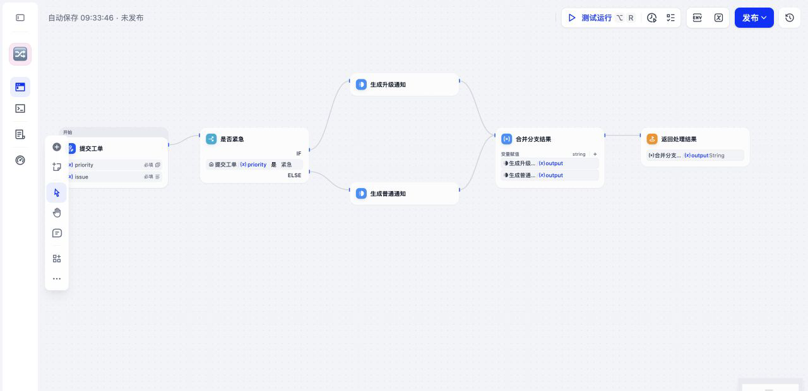
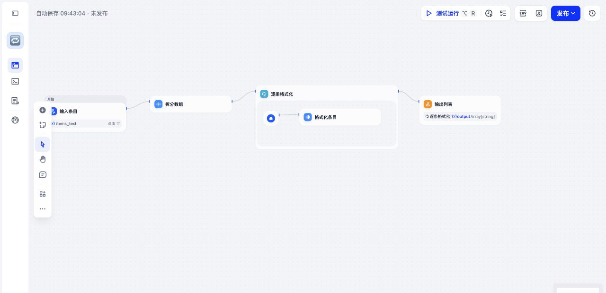
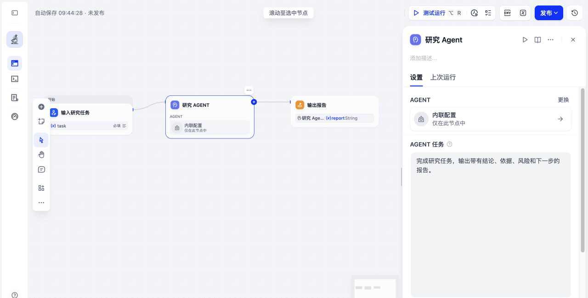

# Dify Workflow DSL Skill

> 让 AI 编程 Agent 生成、修复、审查、迁移和校验 Dify App DSL。

[English](./README.md) · [10 个 Dify 1.16 示例](./examples/dify-1.16.0) ·
[评估报告](./references/dify-1.16-evaluation.md)

> [!IMPORTANT]
> **现已支持 Dify 1.16.0 与 App DSL `0.7.0`，包括 Agent v2 工作流节点。**
> 截至 2026-07-21，Dify 1.16.0 是官方最新版本；本仓库已使用对应 tag 源码和
> 真实 Console 导入路径核验。参见
> [Dify v1.16.0 发布说明](https://github.com/langgenius/dify/releases/tag/1.16.0)
> 与[实测证据](./references/dify-1.16-evaluation.md)。

## 🎯 版本策略

> [!IMPORTANT]
> **Dify 1.16.x → App DSL `"0.7.0"`**
>
> 新工作流默认使用这个版本，并支持可移植 **Agent App** 和
> **Agent v2 工作流节点**。

| 目标工作区 | DSL 版本 | 策略 |
| --- | --- | --- |
| **Dify 1.16.x** | **`"0.7.0"`** | 新建工作流的默认目标 |
| Dify 1.15.x | `"0.6.0"` | 兼容生成与校验 |

如果 Dify 提示 DSL 版本不兼容，请先确认目标工作区版本。Dify 1.15.x 不能靠
忽略提示或只修改 `version` 来兼容 0.7.0 文件，应选择以下方式之一：

- 将工作区升级到 Dify 1.16.0 或更高版本；
- 明确让 Agent 为 Dify 1.15.x 生成真正的 DSL 0.6.0 工作流。

本 Skill 支持显式指定目标版本，例如：

```text
使用 $dify-workflow-dsl 为 Dify 1.15.0 创建这个工作流，目标 DSL 版本为 0.6.0。
```

校验时使用同一个目标版本：

```bash
python3 scripts/validate_dsl.py --strict --target-version 0.6.0 workflow.yml
```

> [!TIP]
> **新建应用默认使用 `workflow`。** 只有需求明确需要多轮记忆、
> `sys.query`、聊天文件上传或 `answer` 节点时，才使用或建议
> `advanced-chat`。

## ✨ 能做什么

- 生成 `workflow`、`advanced-chat` 和 DSL 0.7.0 Agent App YAML。
- 支持可移植 Agent v2 package、binding、job、声明输出和 omitted assets。
- 覆盖 Start、End、Answer、LLM、Code、IF/ELSE、Question Classifier、Human
  Input、Iteration、Loop、Assigner v2、工具、触发器、知识检索、文件处理等
  常见节点。
- 修复图连接、分支 handle、selector、依赖和版本专属结构。
- 用稳定诊断码和 JSON 输出审查已有 DSL。
- 保留面向 Dify 1.15.x 的 0.6.0 兼容能力。

本项目把 Dify 官方版本化源码作为 schema 权威；动态插件和工具字段则以目标
工作区导出的最小 DSL 为准。

## 🧪 Dify 1.16 实测评估

仓库维护了 10 个 DSL 0.7.0 场景，覆盖主要静态兼容面：

| 场景 | 覆盖内容 |
| --- | --- |
| 文本摘要 | Start → LLM → End |
| 多轮助手 | Chatflow、`sys.query`、记忆、Answer |
| Excel 分析 | 文件输入、Document Extractor、Markdown 转换、LLM |
| 优先级分流 | IF/ELSE、Variable Aggregator |
| 客服分类 | Question Classifier 三分支 |
| 数组迭代 | Iteration 容器和内部子节点 |
| 质量循环 | Loop 变量和 Assigner v2 |
| 人工审批 | select/file-list 输入和动作分支 |
| Agent v2 工作流 | package、binding、job、声明输出 |
| Agent App | `app.mode: agent` 和可移植 Soul |

10 个场景全部通过：

1. 本仓库验证器的 strict 模式；
2. Dify 1.16.0 自带的生产节点注册表、Human Input 图校验、
   `AgentPackage` 和 `WorkflowNodeJobConfig` 模型；
3. Dify 1.16.0 的真实 `AppDslService.import_app`，使用隔离的 PostgreSQL 和
   Redis：**10 个完成、0 个失败、0 条警告**。

这次评估发现并修复了一个真实问题：旧的有效 fixture 没有写 Dify LLM 节点
强制要求的 `context` 对象，本地验证器却错误放行。详细证据见
[Dify 1.16 评估报告](./references/dify-1.16-evaluation.md)。

### 工作流效果预览

当前维护的示例中，下面两个场景的图节点数并列最多，均为 6 个。两个文件都已
通过真实 Dify 1.16.0 Console 导入，图片直接截取自 Dify Workflow 画布；点击
图片可查看对应源工作流。

#### 工单优先级分流

[](./examples/dify-1.16.0/04-priority-routing.yml)

#### 批量条目格式化

[](./examples/dify-1.16.0/06-array-iteration.yml)

## 🤖 Agent v2 / DSL 0.7.0

Skill 支持两种 0.7.0 Agent 形态：

- 顶层 Agent App：`app.mode: agent` + `agent` + `agent_packages`；
- Workflow/Chatflow Agent v2 节点：`version: "2"` +
  `agent_binding.package_ref` + `agent_job`。

Agent package 可以移植，但密钥和工作区绑定资产不会完整打包。导入后需要检查
警告，并重新连接模型凭据、工具、联系人、Skills、文件和其他 omitted assets。

下图是仓库中的 Agent v2 示例真实导入 Dify 1.16.0 后的界面。被选中的 Agent
节点及右侧“内联配置”面板均由 Dify 实际渲染。

[](./examples/dify-1.16.0/09-agent-v2-workflow.yml)

## 📦 安装

```bash
git clone https://github.com/yzmw123/dify-workflow-dsl-skill.git
cd dify-workflow-dsl-skill
bash install.sh --platform codex
```

支持的平台：

```bash
bash install.sh --platform claude
bash install.sh --platform codex
bash install.sh --platform openclaw
bash install.sh --platform hermes
bash install.sh --platform opencode
bash install.sh --platform all
```

自定义 skills 目录使用 `--target-dir`；覆盖已有安装使用 `--force`。

## 🚀 使用

生成工作流：

```text
使用 $dify-workflow-dsl 创建一个 Dify 1.16 工作流：
读取上传的 Excel，把表格转换为 Markdown，交给大模型分析，并返回 Markdown
表格和分析报告。
```

生成 Agent v2 工作流：

```text
使用 $dify-workflow-dsl 创建 DSL 0.7.0 工作流，加入可移植 Agent v2 节点、
声明输出和 package ref，并执行 strict 校验。
```

修复已有文件：

```text
使用 $dify-workflow-dsl 审查并修复这个 YAML。保留它当前受支持的 DSL 版本，
列出所有导入阻断问题和仍需在工作区完成的配置。
```

遇到陌生插件工具时，最好提供目标工作区导出的最小 DSL。它比只给插件市场
页面或工具名称可靠得多。

## ✅ 校验

安装开发依赖：

```bash
python -m pip install -r requirements-dev.txt
```

运行本地校验和测试：

```bash
python3 scripts/validate_dsl.py --strict --target-version 0.7.0 workflow.yml
python3 scripts/validate_dsl.py --format json --strict workflow.yml
python3 -m unittest discover -s tests -v
python3 scripts/validate_dsl.py \
  --strict \
  --target-version 0.7.0 \
  examples/dify-1.16.0/*.yml
```

如果本机有 Dify 1.16 的 Python 3.12 API 环境：

```bash
python scripts/validate_with_dify_source.py \
  --dify-source /path/to/dify-1.16.0 \
  examples/dify-1.16.0/*.yml
```

本地验证器覆盖版本/模式兼容、图端点与可达性、循环、分支覆盖、容器拓扑、
selector、模板节点 ID、Human Input、Agent schema、依赖和常见 SQL 风险。
任何可被 PyYAML 解析的输入都会返回结构化诊断；单个坏文件不会中断批量校验。

## 🗂️ 仓库结构

```text
.
├── SKILL.md                         # Agent 核心执行规则
├── examples/dify-1.16.0/            # 10 个 DSL 0.7.0 场景
├── references/                      # 源码核对后的 schema 与模式
├── scripts/
│   ├── dify_dsl_validator/          # 可复用验证器包
│   ├── validate_dsl.py              # 本地确定性校验 CLI
│   └── validate_with_dify_source.py # Dify 源码兼容校验
├── tests/                           # fixture 与回归测试
├── install.sh
├── README.md
└── README_CN.md
```

## ⚠️ 校验边界

静态校验不能证明工作流在所有工作区都能直接运行。以下内容仍需在真实 Dify
1.16.x 工作区导入和执行：

- 已安装的插件版本和动态工具 schema；
- 模型是否可用以及模型凭据；
- 知识库、联系人、Skills、文件和私有资产；
- 外部 API、Human Input 投递和副作用；
- UI 保存、重新导出和运行时行为。

公开 DSL 不应包含任何凭据。数据库操作优先使用固定、参数化 SQL，避免让模型
直接生成写操作或 DDL。

## 📚 研究基础

项目资料来自 Dify 官方版本化源码、个人导出文件，以及 262 个可解析的公开
App DSL。公开样例适合研究图结构和旧版兼容，但不会被当作当前 schema 权威。

主要链接：

- [Dify](https://github.com/langgenius/dify)
- [Dify Marketplace](https://marketplace.dify.ai/)
- [Dify 官方插件](https://github.com/langgenius/dify-official-plugins)
- [Agent Skills specification](https://agentskills.io/specification)

## 欢迎关注微信公众号

欢迎关注我的微信公众号：**硅基斥候 S01**。目前账号刚起步，如果觉得这个
skill 对你有帮助，请帮我涨个粉丝。我会持续发布自己亲测后觉得好用的
skill，以及 AI 相关的资讯和知识。

**侦查方向**

硅基斥候 S01 关注大语言模型、AI Agent、AI 编程与工具链、产品实测、政企
AI 落地，以及政策、安全与合规。

**为什么叫斥候？**

斥候先进入未知区域探虚实，再把有用的情报带回来。

放到 AI 语境里，S01 做的就是亲测新模型、新工具和新产品，核对风险边界，
把可行动的判断说清楚。

我自己开源的其他项目也会第一时间在公众号公布。


